# Welcome to Gatekeeper IOT
[Check de documentation in english here](./README.en.md)

# Bem-vindo ao Gatekeeper IOT!

Olá, eu sou o Porteiro Eletrônico, ou melhor, um sensor IOT para quem esquece "coisas" abertas, como portões eletrônicos ;)...

Fui construído usando um Wemos D1 (ESP8266) com alguns anabolizantes como integração com a Alexa (minha irmã mais velha) e o IFTTT (If This Then That) um site que permite me integrar com um mundo de coisas.

## Fotos

Case fechado | Case aberto | Sensores
---------|----------|---------
 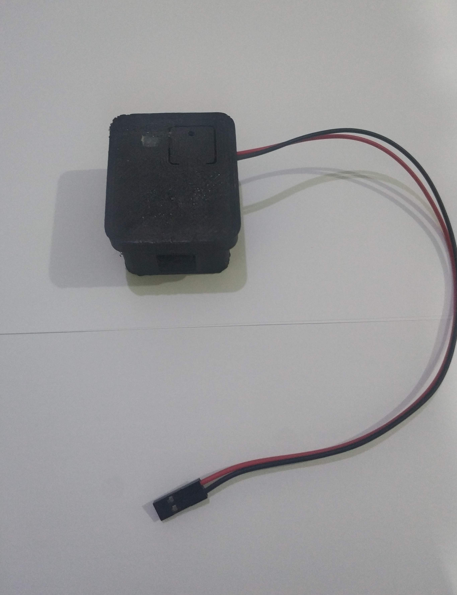 | 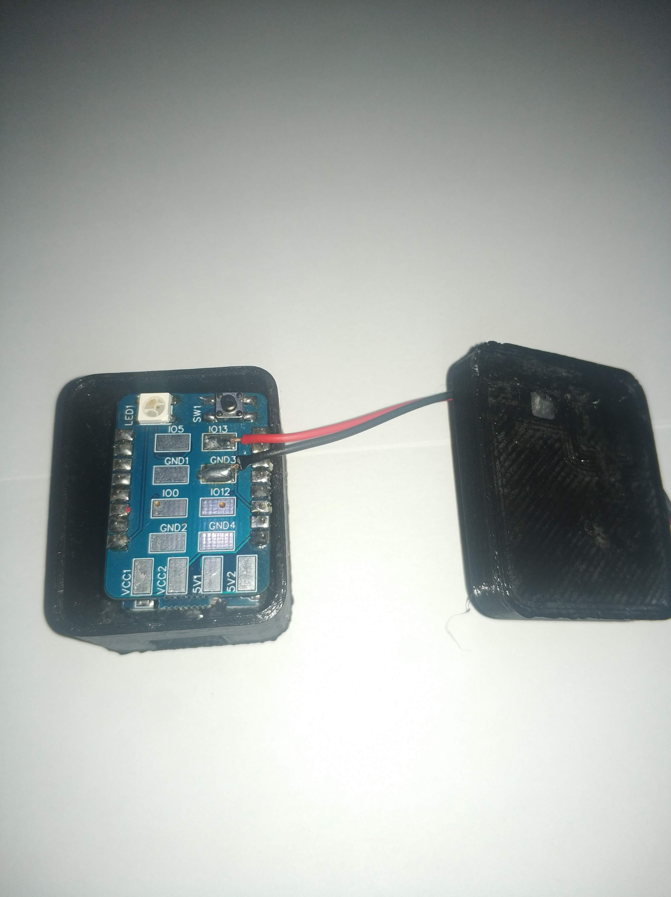 | 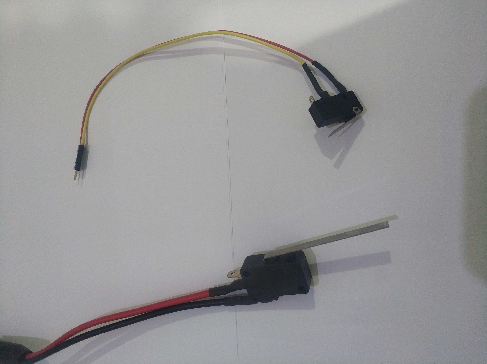

# Primeiras configurações

Ao me ligar pela primeira vez, você precisará configurar as credenciais do Wifi para eu poder criar "asas". Isso é identificado se você não ver uma luz "azul forte" ou "vermelha" no meu case, ou seja, luzes apagadas indicam falta de configuração. Caso você precise refazer a configuração você também pode executar o procedimento de reset, que explico abaixo:

### Resetando as configurações

- Me ligue e espere uns 10 segundos.
- Você precisará me rebootar 2 vezes em um intervalo de 6 segundos e para me rebootar, basta dar um duplo click no botão.
- Duplo click ... espera 6 segundos ... Duplo click.

Nesse ponto criarei uma rede sem fio chamada GateKeeper_XXXXXX, basta você acessar do seu celular / tablet / computador, que irei mostrar as páginas de configuração como descreverei abaixo:
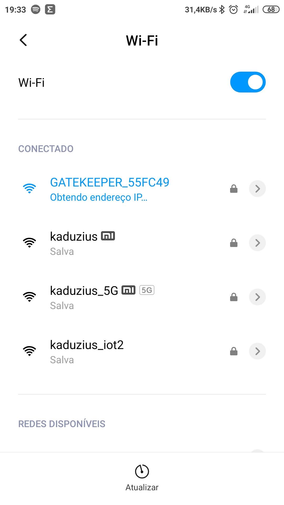
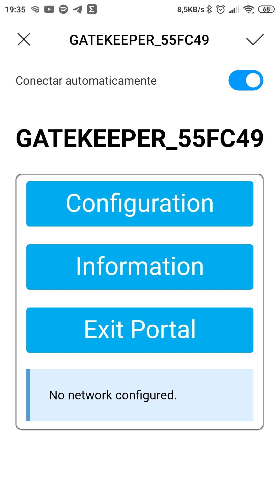
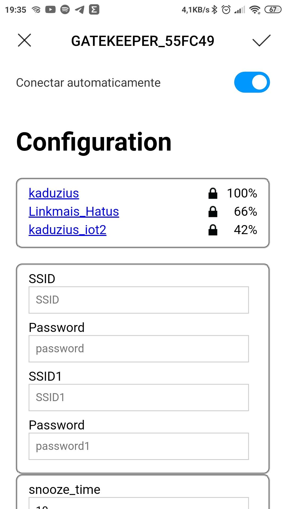
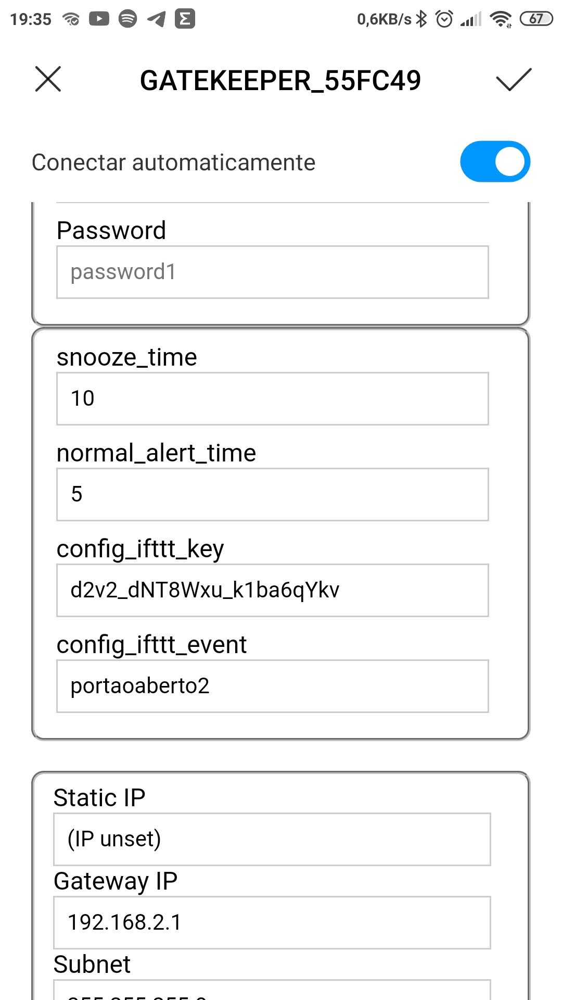
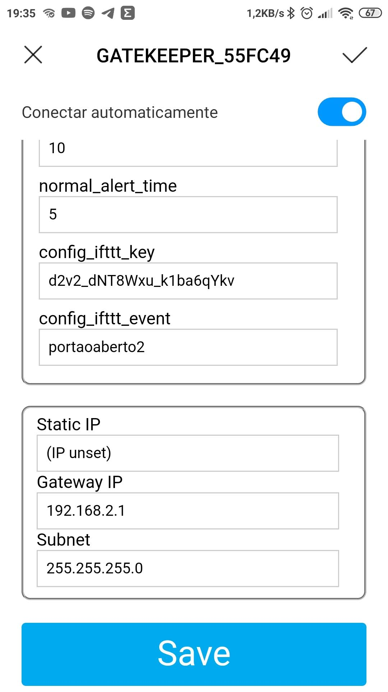

## Configurando o tempo dos avisos
Como você viu nas telas acima, existe 2 configurações relacionadas a tempo:
- **snozze_time** - Esse é o tempo que ficarei "quieto" sem mandar mensagens.
- **normal_alert_time** - Já esse é o intervalo de tempo que ficarei mandando alertas.

Explicando melhor o funcionamento, depois que o portão abrir, mandarei a primeira mensagem de esquecimento após **normal_alert_time** minutos, e depois mando de novo, de novo, de novo... até o portão fechar... MAS se você quiser que eu não mande tantas mensagens, você clica no botão de soneca (Snooze) e então vou esperar **snooze_time** para voltar a mandar as mensagens. E visto que mandei mensagem, vou avisar quando o portão foi fechado também!

## Configurando as chaves do IFTTT
Mais abaixo falo da integração com o site IFTTT, e é nessa tela que você irá fazer a configuração da **chave** e do **evento** que irá informar a plataforma para quem deve ir à mensagem. Bem simples e poderoso! ;)

## Um pouco sobre as Integrações

Como uma forma de aumentar as possibilidades do meu uso, fui desenvolvido e integrado com 2 incríveis plataformas que me dão poderes extraordinários, permitindo que, por exemplo, eu abaixe o volume do som da casa de alguém quando o portão for fechado, ou até mesmo faça uma ligação telefônica. Enfim, um mundão de coisas.

A integração com a irmã **Alexa** é bem tranquila, basta eu estar conectado com a rede e a minha mana já vai conseguir me encontrar. Eu aparecerei lá como uma lâmpada, mas não fique preocupado, é só um jeito que achei de falar com ela e ela me entender, afinal ela é gringa, fala umas línguas  estranhas :D. Porém, esse fato permite que quem comandar a **Alexa** possa me utilizar como gatilho para suas integrações, imagina que você quer acender uma lâmpada toda vez que o portão estiver aberto, eu posso ajudar com isso ;)

Já a integração com o site If This Then That é um pouco mais complexa, porém como o Tio Ben sempre nos ensinou:
- Com grandes poderes vem grandes responsabilidades.

Dessa forma, também posso ser usado como gatilho para integrações usando essa plataforma. Para configurar minha ligação com esse serviço no momento de configuração do meu Wifi, você pode entrar com alguns dados, e dessa maneira, sempre que tiver eventos, irei avisar o site. Veja abaixo como fazer um gatilho.

Acesse o site [ifttt](https://ifttt.com/explore) e crie sua conta.

Logo depois você cairá na tela de pesquisa, entre com o termo webhooks e clique no icone azul
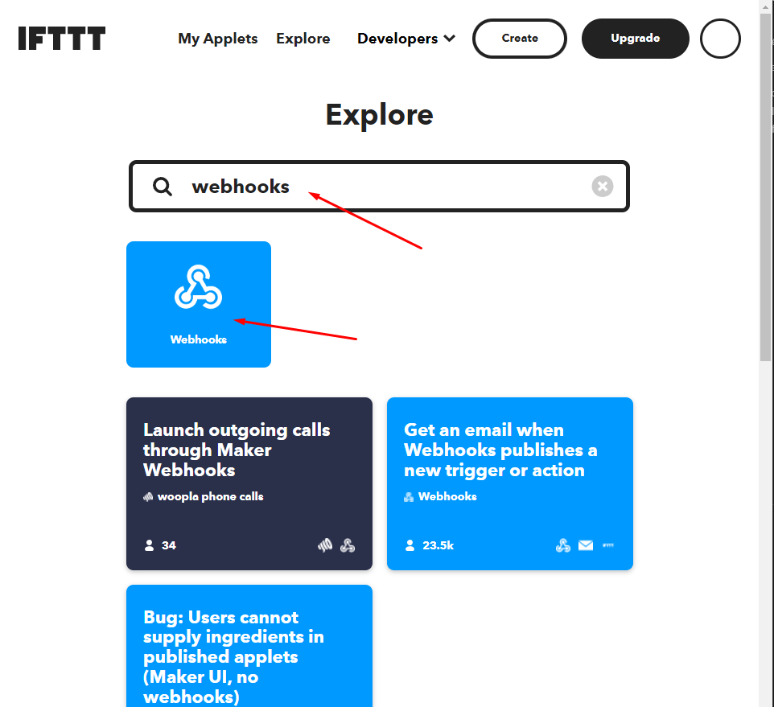

Na próxima tela clique no botão "Create" e você cairá na tela que é "O nome do site" veja:
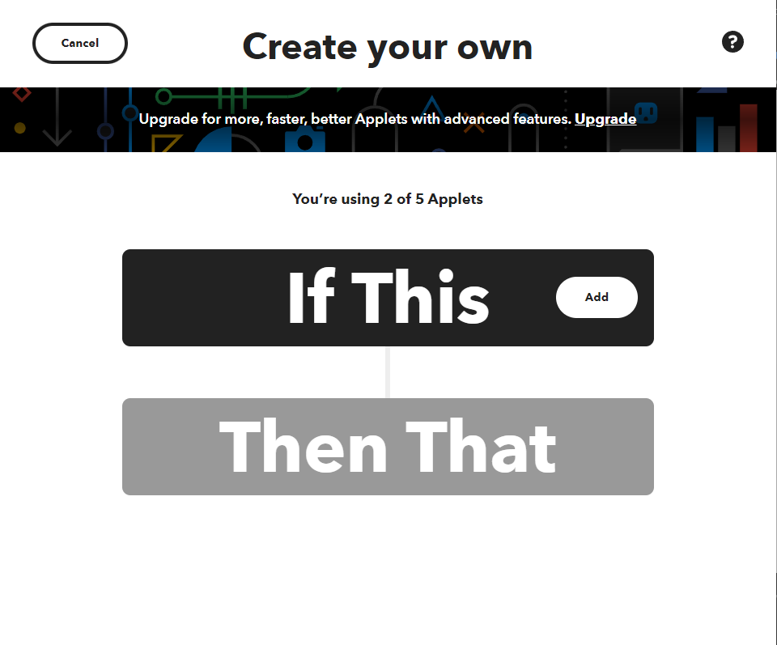

Agora basta seguir os passos, clique no "Add", procure novamente por Webhooks e então você estará nessa tela:
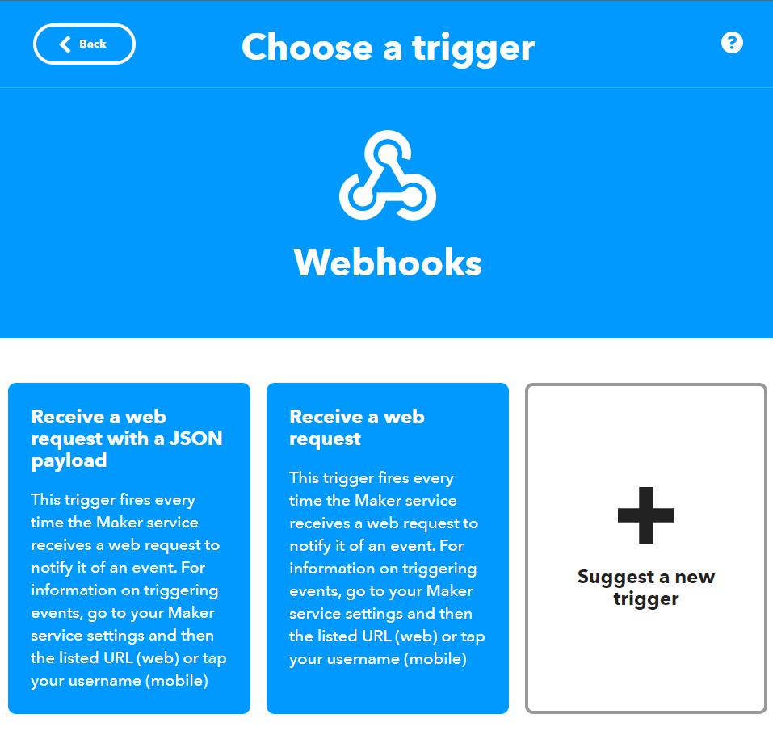

Clique em "Receive a web request" e então coloque o nome do evento desejado, sugestão -> **gatekeeper** e clique em "Create trigger"
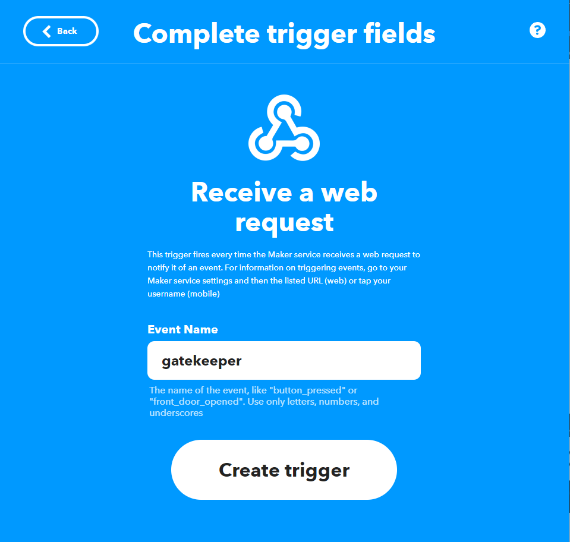

Agora sua tela ficou como a tela abaixo, clique em  "Then that"
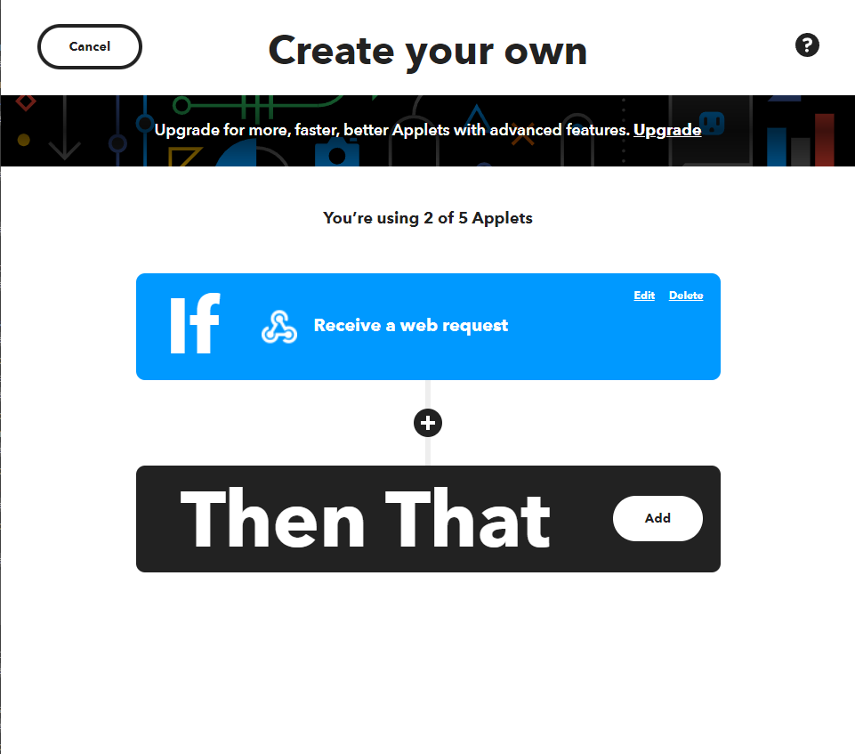

Nesse momento é que você observará o poder dessa plataforma e o quão legal é eu estar integrado com ela, pois dessa maneira como falei agora pouco é possível fazer integrações com todos os "ícones" que você está vendo aí na página, vou deixar uma foto aqui e você vai "cansar" de dar scrooll pra ver o final.

Não te disse? :D

Agora escolha a integração que você desejar, eu vou escolher PushBullet para te mostrar como configurar, mas fique a vontade ;) - O Pushbullet permite que você mande notificações para seu celular.
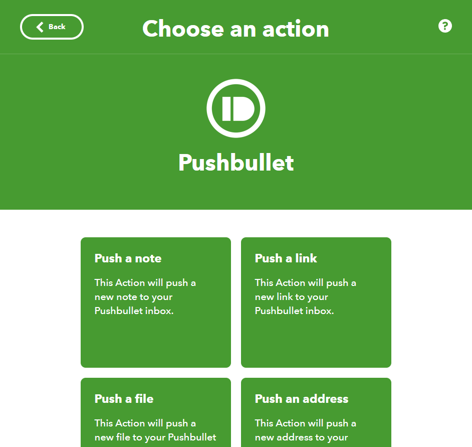

Na tela de configuração eu escolhi "Push a note" e fiz as configurações necessárias para ele enviar a notificação.
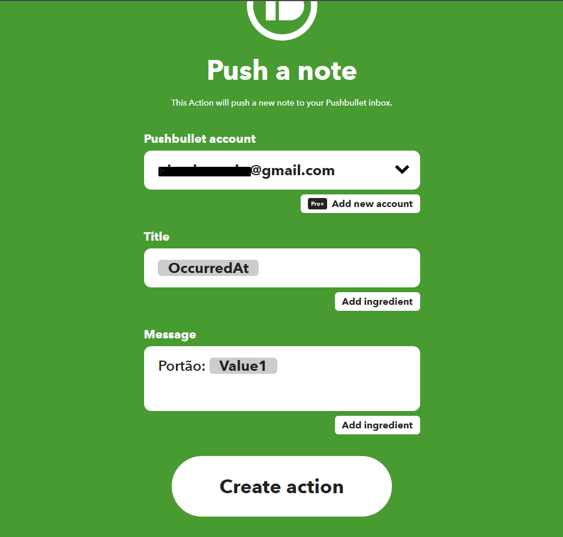

Perceba que alterei ali a mensagem, e coloquei aquele "Value1" que você encontra clicando em "Add ingredient", isso permitirá que eu envie qual é o "status" do portão quando mandar as mensagens.

Pronto, não demorou nem doeu, e aqui estou falando com a **Alexa** e com esse mundo de integrações possíveis através do IFTTT.